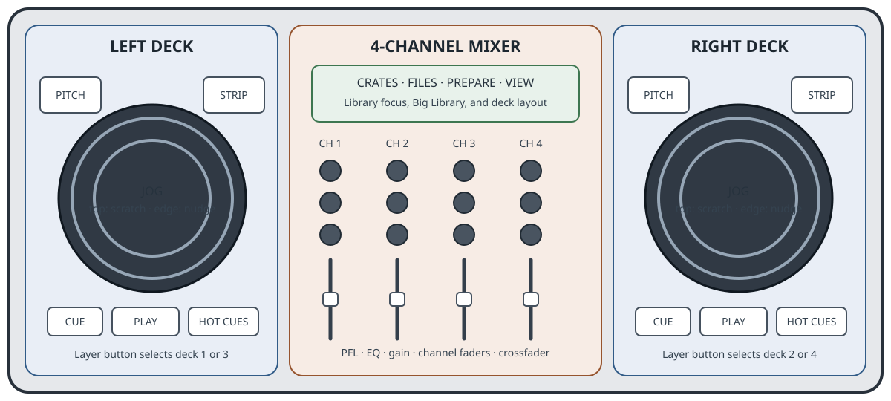

(numark-ns6)=

# Numark NS6

```{figure-md}
:align: center



Numark NS6 control areas. The deck controls operate decks 1/3 and 2/4 through the layer buttons.
```

The Numark NS6 is a four-channel DJ controller and mixer with two touch-sensitive jog wheels. The left and right deck sections can each switch between two Mixxx decks, giving direct hardware control of decks 1–4.

- [Manufacturer product page](https://www.numark.com/product/ns6)
- [Numark NS6 Quickstart Guide](https://www.numark.com/images/product_downloads/ns6___quickstart_guide___v1_01.0.pdf)
- [Numark NS6 Serato DJ Control Map](https://www.numark.com/images/product_downloads/NS6_-_Serato_DJ_Control_Map_-_v1.0.pdf)
- [Related Mixxx issue: NS6 mapping request](https://github.com/mixxxdj/mixxx/issues/15856)

:::{versionadded} 2.7.0
:::

## Mapping and setup

The mapping is for the **original Numark NS6**, not the NS6II. It uses the NS6's MIDI controls and supports Mixxx 2.5.0 and later. The preset is named **Numark NS6** in Mixxx's controller preferences.

Mixxx uses the NS6 MIDI input and output ports exposed by the operating system. Alternative drivers for the original NS6 are available from the maintainer's GitHub projects: [Linux](https://github.com/maurojuniorr/numark-ns6-linux), [macOS on Apple silicon](https://github.com/maurojuniorr/numark-ns6-mac-arm64), and [macOS on Intel](https://github.com/maurojuniorr/numark-ns6-mac-intel). Configure audio-device availability and channel routing separately in Mixxx's audio preferences.

The mapping was tested by its maintainer with an original NS6 on Ubuntu 26.04 LTS, Fedora 43, and macOS Sequoia. It does not target the NS6II. Availability of the NS6's MIDI ports depends on the driver or USB MIDI bridge used on each system.

## Controls

The mapping keeps the controller's four-channel layout and adds feedback for its LEDs. Controls in each deck section follow the selected layer: the left layer selects deck 1 or 3, and the right layer selects deck 2 or 4.

| Control | Mixxx action |
| --- | --- |
| **Layer left / right** | Select decks 1/3 or 2/4. The layer LEDs follow the selected decks. |
| **Play** | Toggle playback on the selected deck. |
| **Cue** | Use Mixxx's native Cue behavior, including preview while held. |
| **Hot Cue 1–5** | Trigger the corresponding hotcue; **Shift + Hot Cue** clears it. |
| **Load** | Load the selected track to the corresponding deck; **Shift + Load** ejects the track. |
| **Jog top** | Scratch while touched when scratch mode is enabled. Releasing returns to playback without following platter inertia. |
| **Jog edge** | Pitch bend during playback; jog or scrub the track while paused. Fast reverse motion can continue as a backspin. |
| **Scratch** | Toggle scratch mode for the selected deck. |
| **Strip Search** | Seek to the position indicated by the touch strip. |
| **Pitch fader** | Adjust playback rate with 14-bit MIDI data. The range button cycles through ±8%, ±16%, and ±50%. Center and beatmatching LEDs provide pitch guidance. |
| **Pitch bend − / +** | Temporarily slow down or speed up the selected deck. Shift uses finer steps. |
| **Sync** | Toggle Sync; **Shift + Sync** toggles Quantize. |
| **Loop controls** | Toggle automatic/manual mode, set manual loop in/out points, activate or exit loops, and select or change automatic loop sizes (1, 2, 4, or 8 beats). |
| **Skip + jog** | Beat-jump in the direction of platter movement. |
| **Grid Set/Clear and Adjust/Slip** | Set, clear, or adjust the selected deck's beatgrid. |
| **Reverse** | Toggle reverse playback; the shifted hold action provides Reverse Roll. |
| **Tap** | Tap the tempo for the selected deck. |
| **Crates / Files** | Focus the library sidebar or file search. The buttons preserve the current library view. |
| **Prepare** | Toggle Big Library view. Its LED follows the view state. |
| **View** | Toggle between two-deck and four-deck layouts. |
| **Library encoder** | Browse tracks or playlists in the current navigation context; press to expand or collapse the selected sidebar item. |
| **Back / Fwd** | Move library focus between navigation areas. |
| **Load Prepare** | Add the selected track to the end of Auto DJ. |
| **Channel PFL** | Selecting one channel disables PFL on the other channels. Pressing the active PFL button again turns it off. The NS6 mixer controls the PFL LEDs. |
| **Channel faders, gain, and EQ** | Control the corresponding Mixxx channel. Fader endpoints are shaped to reach minimum and maximum reliably. |
| **Channel input switch** | Toggle mute for the corresponding Mixxx channel. |
| **Crossfader** | Control the Mixxx crossfader. The separate X-Fader knob adjusts the crossfader curve. |
| **Crossfader assignment** | Assign the deck to the left or right crossfader side; releasing the control returns it to center. |
| **Fader Start** | Enable crossfader-endpoint start/return-to-cue behavior for the corresponding side. |
| **Master / headphone level / Cue-Mix** | Control Mixxx's master level, headphone level, and cue-to-master headphone blend. |
| **Effects controls** | Toggle effect units, select effects, adjust parameters and wet/dry, and assign channels or master to effect units. |

## Audio routing

When the NS6 audio interface is available, assign the main output to channels 1–2 and headphones to channels 3–4 in Mixxx's audio preferences. Do not enable output mirroring unless it is needed for a separate routing setup.

For controls that depend on the current Mixxx version or skin, the controller's LEDs reflect the state exposed by Mixxx. Features not listed above remain available through Mixxx's interface and keyboard shortcuts.
